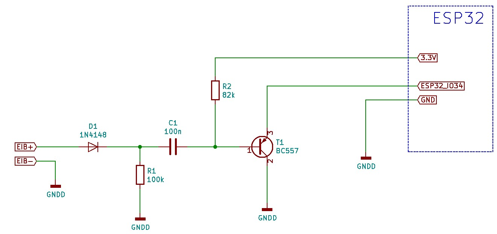

# ESP32-KnxSniffer
Sniffer to log telegrams on KNX Bus
You need a ESP32 and a little bit of Hardware.
Connect them as showed in the following schematic.

from https://www.freebus.org/content/freebus-grundschaltung

Bustiming: https://freebus.org/system/files/01_bits_und_bytes.pdf

Description of protocol: 
http://www.see-solutions.de/sonstiges/KNX%20Twisted%20Pair%20Protokollbeschreibung.pdf
